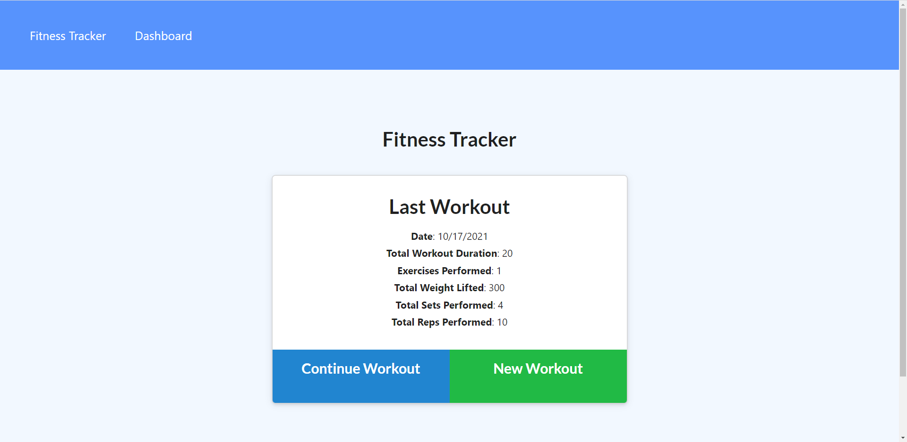

# Bk_Workout-Tracker

This application is a workout tracker that allows a user to create, and track his daily excersices.  The application was implemented using Mongoose schement and uses routes with Express.

## User Story

The application allows the user to view create and track daily workouts. He is able to log multiple exercises in a workout on a given day. He is also be able to track the name, type, weight, sets, reps, and duration of exercise. Two different type of exercises are implemented in this application.

## Below is the Link of Heroku deployment
https://radiant-retreat-43140.herokuapp.com/?id=616f856c408d9e0016e1294c
## Below is a screen_shot of the application main page
Application Main Screen Shot : 

Dashboard: 
